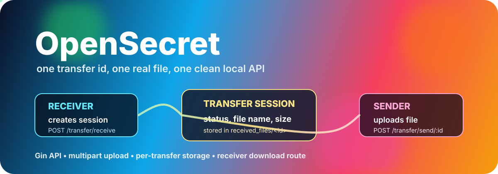

# OpenSecret



OpenSecret is a local file handoff API built in Go. A receiver opens a one-time transfer session, a sender uploads a real file into that session, and the receiver downloads the stored file through a clean route.

This is not a generic upload demo. The project models a file exchange as two roles: receiver and sender. The receiver owns the transfer id. The sender can only upload when that id exists. After upload, the session records the filename, byte size, status, creation time, and completion time.

## What It Does

| Layer | Route | Purpose |
| --- | --- | --- |
| Receiver | `POST /transfer/receive` | Creates a waiting file transfer session |
| Receiver | `GET /transfer/receive/:id` | Shows the current session status |
| Receiver | `GET /transfer/receive/:id/download` | Downloads the uploaded file |
| Sender | `GET /transfer/send/:id` | Shows how to upload into a session |
| Sender | `POST /transfer/send/:id` | Uploads a file with multipart field `file` |

## Run It

```bash
make run
```

The API starts on port `8080` by default:

```text
http://localhost:8080
```

Run it on another port when `8080` is busy:

```bash
PORT=18080 make run
```

## Try A Full File Transfer

Create a receiver session:

```bash
curl -X POST http://localhost:8080/transfer/receive
```

The response includes a transfer id plus direct send, status, and download paths:

```json
{
  "message": "File receive session created",
  "send_url": "/transfer/send/1f4d9a4c0d7b2c90a17e62c4",
  "status_url": "/transfer/receive/1f4d9a4c0d7b2c90a17e62c4",
  "download_url": "/transfer/receive/1f4d9a4c0d7b2c90a17e62c4/download"
}
```

Upload a file into that session:

```bash
curl -F "file=@sandbox/sender/test.txt" http://localhost:8080/transfer/send/<transfer-id>
```

Check the transfer status:

```bash
curl http://localhost:8080/transfer/receive/<transfer-id>
```

Download the received file:

```bash
curl -OJ http://localhost:8080/transfer/receive/<transfer-id>/download
```

## Project Flow

```text
receiver creates session
        |
        v
OpenSecret returns transfer id
        |
        v
sender uploads multipart file
        |
        v
OpenSecret stores received_files/<transfer-id>/<filename>
        |
        v
receiver downloads through /transfer/receive/:id/download
```

## Why This Project Stands Out

OpenSecret keeps the sender and receiver responsibilities separate. The receiver module creates and tracks sessions. The sender module only handles upload behavior. The command entrypoint stays small and only wires HTTP routes.

The storage layout is also easy to inspect. Every completed transfer gets its own directory under `received_files`, named by transfer id. That makes it clear which file belongs to which session while keeping generated files out of git.

## Repository Shape

```text
cmd/main.go                  API entrypoint and route wiring
modules/receiver/models.go   transfer status and transfer model
modules/receiver/router.go   receiver session, status, download, storage
modules/sender/router.go     sender upload and upload instructions
assets/opensecret-banner.svg animated README banner
received_files/              generated file storage, ignored by git
```

## Build Check

```bash
go test ./...
```
